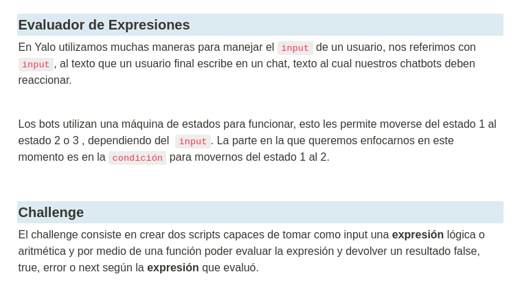
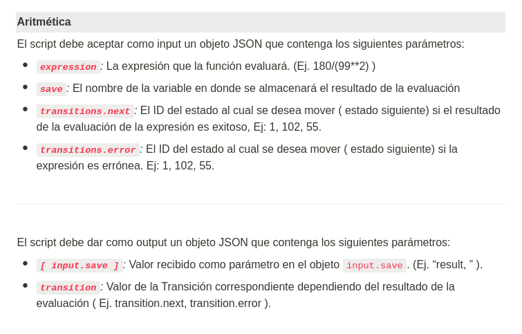
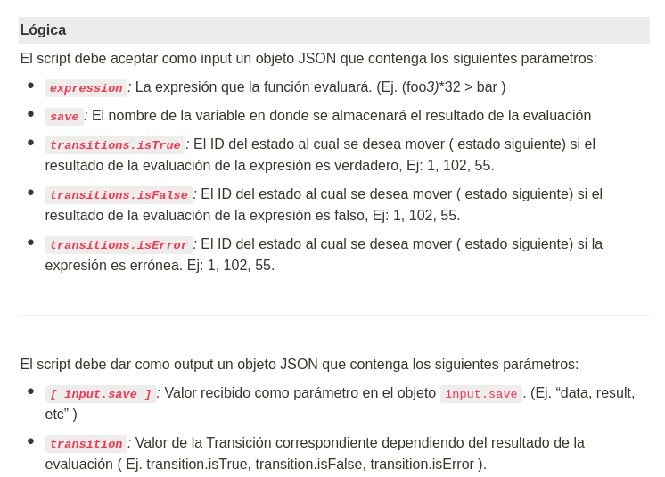
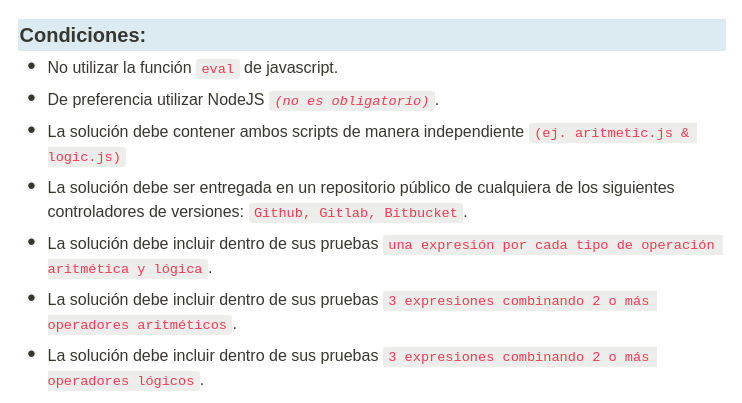

# yalo challenge

[Yalo](https://www.yalochat.com/) code challenge.

## Solution

You can find the solution for every case in files [arithmetic.js](./arithmetic.js) and [logic.js](./logic.js).

### Installation

Install dependencies required using yarn package manager.

`yarn install`

### How to test

In order to test both solutions you can run the test script.

`yarn test`

## References

- [Yalo](https://www.yalochat.com/)
- [Mathjs](https://mathjs.org/docs/getting_started.html)
- [Json Validator](https://www.npmjs.com/package/ajv)
- [Jest](https://www.npmjs.com/package/jest)
